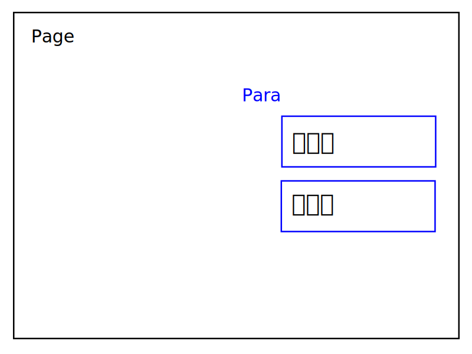

## UniGal-text
Text呈现游戏的台本
## 示例
以这一段BKE脚本为例
```bkscr
*main
你好，[l][r]世界！[p]
```
翻译过来是这样
```xml
<?xml version="1.0" encoding="utf-8"?>
<unigal-script>
  <head>
    <src>
      BKE
    </src>
  </head>
  <body>
    <text>
      <character>Fa鸽</character>
      <pages>
        <page label="main">
          <para>你好，</para>
          <para>世界！</para>
        </page>
      </pages>
    </text>
  </body>
</unigal-script>
```
显示出来是这样
